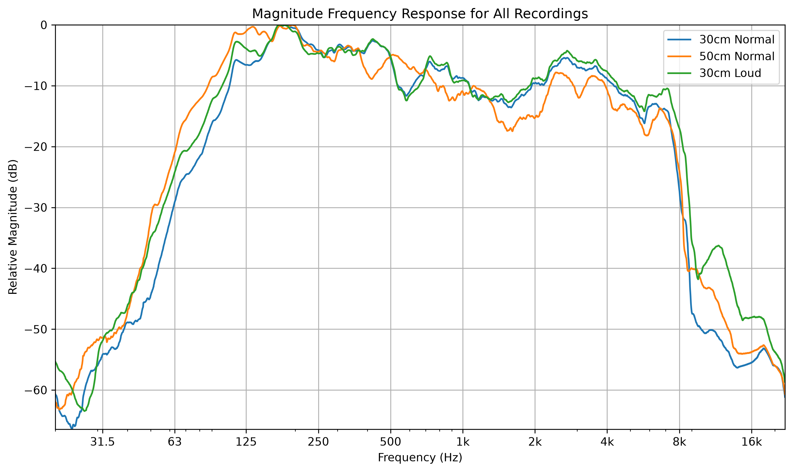

# Analysis of a Loudspeaker using a Standard Microphone
This is a project where a single loudspeaker was monitored over a logarithmic sine-sweep of consistent amplitude, with the output recorded by a regular microphone. This project aims to identify the effectiveness in measuring aspects like the frequency and impulse response using a sub-standard environment and lab setup.

## Running the Code
This code was created to be run on Windows 11 with Python 3.13.5. It is not necessary to run the code however, as all results can be seen in the "graphs" folder of this project.

To run the code, first create a virtual environment and download all dependencies. This can be done by running the following code in the console:
```bash
python -m venv venv
venv\scripts\activate
pip install -r requirements.txt
```

Now, any of the individual files can be run using the following command:
```bash
python -m [file_name]
```


## Equipment
Measurements were recorded using a Fifine AM8 Microphone, connected to a PC using a USB cable. This microphone is specified to have a frequency response of 50-16kHz [1]. The speaker used to take measurements from is a Trumix AR7 loudspeaker, which has a specified frequency response of 50Hz-20kHz plus/minus 3dB [2]. A Trumix TM-12 Audio Interface was used to interface the loudspeaker to the PC.

## Experimental Method
A microphone was placed 50cm away from a speaker, angled so that the microphone capsule was vertically centered between the tweeter and woofer. Both the speaker and microphone were placed on a desk mat to add a small amount of padding to reduce vibration through the table that the experiment was performed on.

In an Audacity project, a chirp was generated with a sine waveform, consistent amplitude and 10 second duration. This chirp plays a monophonic sweep logarithmically from 20Hz to 20kHz. This waveform was chosen as a sine wave is a single tone without any harmonics, so a single frequency can be monitored at one time. Other tracks were created to record microphone input during playback of the chirp. The clip of the waveform was set to start at exactly 5 seconds, allowing for background noise to be picked up before the measurement of the sweep began.

Three recordings were made, with those being at 50cm with a moderately quiet volume, one at 30cm at the same volume, and one at 30cm at a louder volume. After all measurements were made, all tracks were exported as mono WAV files with a sample rate of 44.1kHz and signed 16-bit PCM encoding.


## Results

### preliminary_analysis.py:
This file was made to establish some basic information about the audio files. 

First, a basic amplitude-time plot called `Amplitude_Time_Comparison` was generated to visualise the waveforms and how the background noise compares to when the sweep was playing. First, you can see that the input sweep has a consistent amplitude throughout the entirety of the sweep, which was expected from the values inputted when generating the chirp. Next, you can see that the backround noise in the recordings, marked in red, is not consistent throughout. The unpredictability of this noise means that, even after cleaning and smoothing, the background noise will play an effect on the final results. Finally, a small pop is noticeable where the sweep begins to play. This is most noticeable in the "30cm Loud" subplot, which tells us that the effect is most likely caused by the sudden, significant difference in amplitude [3]. This could be reduced by playing lowest frequency of 20Hz for a set time before recording the sweep.  


The second plot generated is called `Magnitude_spectrum_comparison`, and shows the relative magnitude of the waveforms against frequency. From this plot, we can see a sudden dip in magnitude at about 7kHz, followed by a period of dense oscillation. This is likely where the microphone started being unable to detect the output of the loudspeaker, and the relatively consistent-in-frequency background noise became the focus. Information from this range will be less reliable, which should be considered in later plots.


### impulse_response.py
*This section is currently in development*


### frequency_response.py
*This section is currently in development*




### wiener_vs_naive.py
*This section is currently in development*


## Citations
[1] Fifine. 2026. URL: https://fifinemicrophone.com/products/fifine-ampligame-am8-microphone

[2] Trumix. 2026. URL: https ://www.gear4music.com/Recording-and-Computers/Trumix-AR7-Active-Studio-Monitor-Ex-Demo/7H1

[3] Christopher Dobrian. Simple amplitude control. URL: https://music.arts.uci.edu/dobrian/maxcookbook/simple-amplitude-control